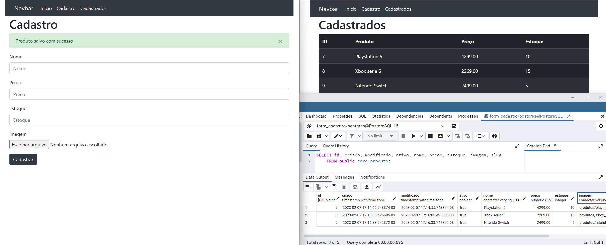
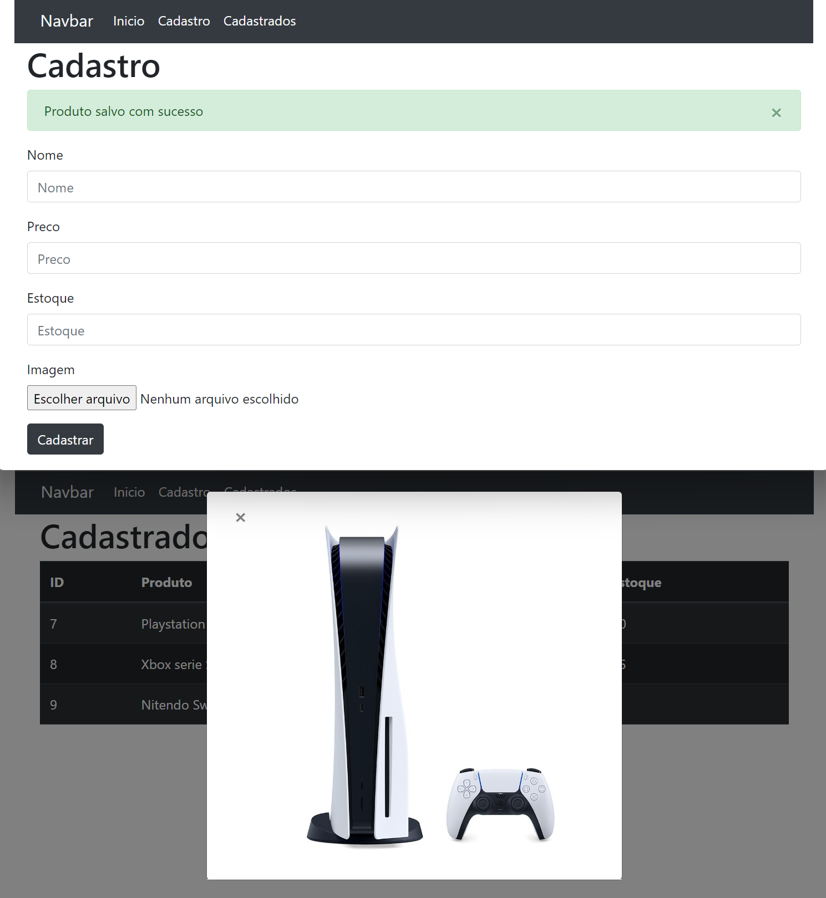

# Criação pagina de cadastro  
 

### Descrição:

A pagina de cadaastro é uma ferramenta de gestão que centraliza, 
em um único ambiente, todos os dados e informações que tiverem, 
ou ainda têm, relacionamento com a sua empresa.

### O que foi feito:

- Criado projeto e aplicação
- Configurado settings 
- Criação do fomrs e migração para o banco
- Criação templates
- Criação do views
- Criação do modal

### Exemplo visual:

- Exibindo cadastro no banco

- Exibindo modal

